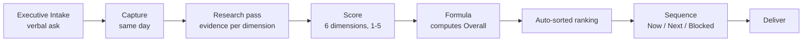

# Pipeline Tracker

**A directive can't be refused. A ranked directive can be sequenced.**

That sentence is the whole product. Executive Intake asks arrive verbally, land on a squad already running a 40/20/20/20 contract, and each one arrives sounding like the most important thing said that week. Without an instrument, every ask becomes "ASAP," ASAP becomes meaningless, and the squad delivers on volume instead of value.

This tracker replaces "ASAP" with a number, and a number with an order. Nothing gets dropped; not everything jumps the queue.

## The flow



Five things happen, in order, and only one of them is a judgement call:

| Stage        | Who                | When              | Output                             |
| ------------ | ------------------ | ----------------- | ---------------------------------- |
| **Capture**  | Whoever heard it   | Same business day | Verbatim + interpreted requirement |
| **Research** | Owner              | Before scoring    | One line of evidence per dimension |
| **Score**    | Squad lead + owner | Weekly sync       | Six numbers, 1–5                   |
| **Rank**     | The tracker        | Instantly         | Overall Score, auto-sorted         |
| **Sequence** | Squad lead         | Weekly sync       | Now / Next / Blocked               |

Ranking is arithmetic, not opinion. That's the point — the argument moves from *"is this important?"* to *"is this a 4 or a 3 on client impact?"*, which is a question evidence can settle.

## Why capture is a discipline, not a connector

There is no API on a verbal instruction. So the intake layer is a habit with a deadline: **the ask gets written down the same business day**, mirroring the charter's existing one-business-day desk SLA.

Two fields, always, and they are not the same field:

- **Verbatim** — the exact words. No cleanup.
- **Interpreted requirement** — what we believe is being asked for.

The gap between them is where projects die. "Can we look at Gemini Enterprise for them, if it's cheap?" paraphrased into "evaluate Gemini Enterprise for Client X" has silently dropped a budget constraint and invented a commitment. Keeping both fields makes the drift visible instead of structural.

## The scoring model

Six dimensions, 1–5, anchored in [[Scoring Rubric]]. Five measure value; one measures cost.

```
Overall = (0.30·ROI + 0.20·Strategic + 0.20·Impact + 0.15·Urgency + 0.15·Culture)
          − (0.25·Complexity)
```

Complexity **subtracts**. A valuable ask that is disproportionately hard ranks below an equally valuable one that is cheap — which is the correct commercial instinct, made explicit. Range: **−0.25 to 4.75**.

The formula is enforced in the tracker, not typed by hand. Nobody negotiates their own total.

**These weights are a starting instrument, not a finding.** They encode a defensible bias — revenue first, strategy and client exposure equal second, urgency and culture as tie-breakers, complexity as a real brake. Borrowing the charter's own language: instruments get recalibrated. Review the weights after the first full cycle, against the question *"did the top of this list turn out to be the right work?"*

## Scoring and scheduling are separate steps

Score once. Re-sequence often.

Resource availability deliberately **stays out of the formula**. Whether we have someone free this week is a fact about us, not a property of the ask — fold it into the score and next month's re-check reshuffles the ranking while no ask has actually changed in merit.

So availability drives the **slot**, not the score:

| Slot | Meaning |
|---|---|
| **Now** | Ranked high and the people are free. In flight. |
| **Next** | Ranked, waiting on capacity. Default state. |
| **Blocked** | Waiting on a dependency, decision, or approval. |
| **Done** | Delivered. Keeps its score as a record; out of the capacity rotation. |

An ask keeps its score while its slot moves. That's what lets you say "not this week" without ever saying "not important."

## Two guardrails inherited from the charter

- **The hot-desk cap holds at 20%.** A high-urgency ask that would breach the cap gets flagged at the weekly sync rather than silently borrowing from the frontier 40%. The tracker makes the breach visible before it happens.
- **ICU/immediate builds need CEO approval before work starts** ([[Field Response Desk]]). When the ask *originates* from the CEO the approval is usually implicit — but the cap above is not waived by it. Log it either way.

## Worked example

> Verbatim: *"Can we get Client X a live dashboard of the benchmark comparisons before their QBR?"*

| ROI | Strategic | Impact | Urgency | Culture | Complexity |
|---|---|---|---|---|---|
| 4 | 5 | 5 | 4 | 3 | 3 |

`Overall = 4.25 − 0.75 = 3.50` → strong band. Harness already exists, so it's mostly a presentation layer → **Now**.

Note what the rubric caught: had the QBR been ten days out rather than imminent, Urgency would be a 4, not the 5 it felt like in the room — and the total drops to 3.50. One anchor, one point, and the ranking stays honest.

## The live tracker

![[Priority Ranking.base]]

Two views: **Priority ranking** (scored items, sorted by Overall Score, highest first) and **Awaiting scoring** (captured but not yet scored, oldest first — so the queue nags).

## How to run it

1. **New ask** → create a note in `Intake/`, run **Templates: Insert template** → *Executive Intake Entry*, fill verbatim + interpreted. Same day. Leave scores empty; it lands in the tracker's **Awaiting scoring** view, oldest first.
2. **Weekly sync** → research pass, then score. Status moves to `Scored` and the row joins the ranked view automatically.
3. **Read the ranking** → open [[Priority Ranking.base]]. Sorted by Overall Score, highest first, no manual re-sorting.
4. **Set slots** → assign Now / Next / Blocked against current capacity. Don't touch scores.

## Deliberately not built yet

- **No automated ingestion.** The source is a person talking; there's nothing to poll. Revisit only if asks start arriving in writing.
- **No automated research/scoring.** Scores need defensible evidence a human will stand behind in front of the CEO. Machine-suggested scores are a fast-follow once ~10 real entries exist to calibrate against — that's also the point at which weight recalibration has data.
- **No effort estimates in hours.** Complexity 1–5 is enough to rank. Hours are a planning artifact, not a prioritization one.

## Files here

| File | Purpose |
|---|---|
| [[Priority Ranking.base]] | The live tracker. Auto-computed, auto-sorted. |
| [[Scoring Rubric]] | 1–5 anchors per dimension. The reason two people score alike. |
| [[Executive Intake Entry]] | The template, in `_Templates/`. Inserted via **Templates: Insert template**. |
| [[Executive Intake Entry (Shipped)]] | Retrospective template, same folder. For work already delivered — scores Complexity on what it *actually* cost, which is how the rubric gets calibrated. |
| `Intake/` | One note per ask. Each note is one row. Data only — no templates, no examples. |
| [[Publishing]] | Read-only web view for leadership. Setup + the access-control gate. |

## If the Overall column shows an error

The formula guards against half-scored rows with a six-way `&&` check. If your Obsidian build doesn't accept that, replace the formula in `Priority Ranking.base` with the single-guard version — same arithmetic, looser guard:

```
if(note.roi, (0.30 * note.roi + 0.20 * note.strategic + 0.20 * note.impact + 0.15 * note.urgency + 0.15 * note.culture - 0.25 * note.complexity).round(2), "—")
```

Sanity check either way: the example row must read **3.5**.
